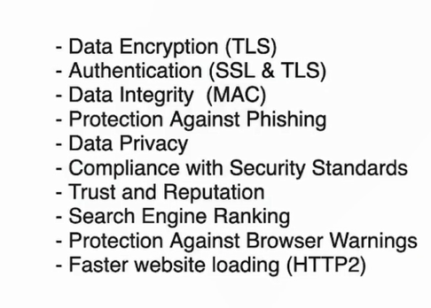

# CORS

# PII

# Input Sanitization

# Validation

# Web Storage

# Authorization

- never put authorization token in localstorage
- always set expiry date in token

## Security topics -

- XSS
- CSRF
- Authentication/Authorization
- Input validation/Sanitization
- HTTPS
- Security Headers
- Iframe Protection
- Dependency Injection
- Client Storage Security
- Compliance and regulations
- SSRF
- SSJI
- Feature Flag
- Subresource Integrity
- CORS

### XSS

- mitigation :
- replace innerHTML with innerText
- Escaping
- Using library like React
- Sanitize: DOMPurifier library
- CSP Headers
  - .setHeaders(
    'Content-Security-Policy',
    "default-src 'self' ;"+
    "screipt-src 'self' 'nonce-randomkey' 'unsafe-inline' http://unsecure.com"
    )
- Avoid using eval

### Iframe Protection

- vulnerabilities:
- clickhijacking
- Data theft via javaScript
- Session and cookie theft
- Mitigations:
- X-Frame-Options: DENY
- CSP: frame-ancestors 'self' (cannot be used as iframe)
- sandbox="allow same-origin" (in iframe)
- Cookie( httpOnly: true,
  secure: true,
  sameSite: strict)

### Security Headers

- remove server headers - res.removeHeader('X-Powered-By')
- Referrer Policy - res.SetHeader('Referrer-Policy', 'no-referrer')
  res.setHeader('X-Content-Type-Options', 'nosniff')
  - X-XSS-Protection (not required if proper CSP is set)
  - HSTS(Strict Transport security header) (serve only https and internal redirect of http to https)
  - res.setHeader('Strict-Transport-Security', 'max-age=31536000; includeSubDomains;, preload' )

### Client Storage Security

- storing sensitive data on client storage
  - try storing at server
  - encrypt data
  - token expiry
- Authentication
  - JWT/OAuth
  - session token expiry
  - MFA
- Data Integrity
  - checkSum
- Data Storage -
  - localStorage (5-10 mb)
  - sessionStorage (5-10 mb)
  - IndexedDB (50MB -100MB)
  - Cookie (4kb-20kb)
  - Cache (~100mb)
- Session Management

### HTTPS:

- 
